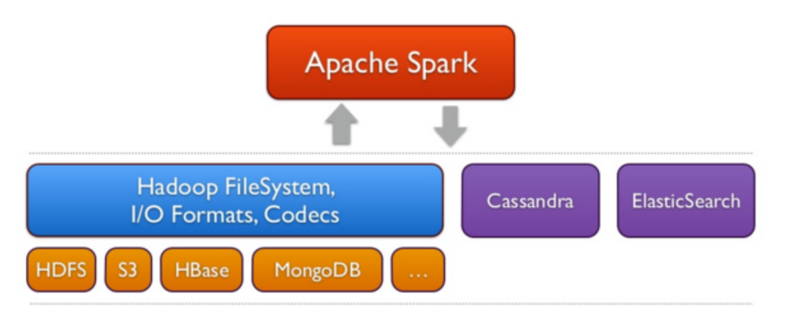

# 1. Spark

### 1.1) Introduction et comparaison avec Hadoop (MapReduce)

**A. Introduction:**

**Spark** est un :
- **framework, open-source** conçu pour le **traitement** distribué de calcul sur de grandes quantités de données (Big Data) sur des clusters de machines. 
- Il s'appuie sur la mise en **cache en mémoire**, et la création et exécution de **requêtes optimisées** pour traiter efficacement ces grosses volumétries de données. 
- Il fournit des API de développement en **Java, Scala, Python et R**. 
- Il permet d'effectuer une grande variété de tâches: traitement par lots, requêtes interactives, analytique en temps réel, machine learning et traitement de graphes.

Apache Spark a été développé initialement en 2009 à l'UC Berkeley's AMPLab dans le cadre d'un projet de recherche. L'objectif de Spark était de créer un nouveau cadre, optimisé pour les **traitements itératifs rapides** tels que le machine learning et **l'analyse interactive** des données, tout en conservant la capacité de mise à l'échelle et la tolérance aux pannes de Hadoop MapReduce.
Il a été introduit pour la 1ère fois en 2014 (1ère release officielle) et aujourd'hui son développement est maintenu par la fondation Apache Software Foundation. 

**B. Comparaison avec MapReduce:** 

1. **Performance** : Spark peut être jusqu'à 100 fois plus rapide que MapReduce pour certaines tâches, grâce au traitement en mémoire. En effet, MapReduce écrit la plupart des données sur le disque après chaque opération de map et de reduce, alors que Spark conserve la plupart des données en mémoire après chaque transformation. Spark n'écrit sur le disque que lorsque la mémoire est pleine. Spark utilise aussi un système de caching, qui permet de conserver et réutiliser certaines données impliquées dans plusieurs opérations. 
   
   
2. **Polyvalent** : Spark supporte plusieurs types de traitements (batch, streaming, machine learning, graphes) dans un même framework.
3. **Flexibilité**: S'intègre bien à l'écosystème Hadoop (et notamment YARN et HDFS), accepte une grande variété de format pour le stockage: HDFS, AWS S3, Cassandra, HBase etc....
   
   
4. **Facilité d'utilisation** : API plus riche et plus intuitive que MapReduce.
5. **Optimisation** : Spark optimise le plan d'exécution avant de lancer les calculs. + Data Locality: en effet, Spark tente d'atteindre la localité des données en préférant planifier les tâches sur les nœuds où les données résident déjà (par exemple, les blocs HDFS). Cela permet de réduire les transferts sur le réseau (quand c'est possible).
6. **Interactivité** : Spark propose un shell (une interface de ligne de commande interactive pour exécuter des commandes Spark) interactif pour l'exploration des données.

**C. Architecture de Spark et principales librairies:**

L'architecture de Spark se compose de :
1. **Spark Core:** Spark Core est le moteur d'exécution de la plateforme. Il est responsable de:
	- la gestion de la mémoire (inclue gestion des RDDs), 
	- la résolution des pannes, 
	- la planification, la distribution et la surveillance des tâches, 
	- ainsi que de l'interaction avec les systèmes de stockage. 
	  
	  Tout un système d'APIs s'appuie sur Spark Core pour exposer ses fonctionnalités. Ces API cachent la complexité du traitement distribué derrière des opérateurs simples et de haut niveau.

2. **API Layers (Couches d'API):** 
	Spark fournit plusieurs couches d'API, toutes construites au-dessus de Spark Core :
	- API de bas niveau : API RDD (partie de Spark Core)
	- API de haut niveau : API DataFrame, API Dataset
	- API spécifiques à un langage : Scala, Java, Python (PySpark), R (SparkR)
	  
	Nos instructions s'appuient sur des librairies qui sont traduitent par les APIs spécifiques. Celles-ci convertissent et communiquent les instructions au Spark Core, qui à son tour va créer et distribuer des opérations à travers le cluster. 

3. **Les bibliothèques haut niveau:** 
	Construit au-dessus du Spark Core, Spark fournit 4 bibliothèques de plus haut niveau pour des tâches spéciales :
	- **Spark SQL** : Module pour le traitement de données structurées/semi-structurées. Pour cela il s'appuie sur une abstraction de données appelée DataFrames. Il permet aussi d'effectuer des requêtes interactives distribuées en s'appuyant sur du SQL ou HiveQL afin d'interroger les données stockées. 
	- **Spark Streaming** : Module pour l'acquisition et le traitement en temps réel (streaming). Il **ingère les données par mini-lots** et permet l'analytique de ces données à l'aide du même code d'application écrit pour l'analytique par lots (batch processing). Cela améliore la productivité des développeurs, car ils peuvent utiliser le même code pour le traitement par lots et pour les applications de streaming en temps réel. Spark Streaming prend en charge les données de Twitter, Kafka, Flume, HDFS et ZeroMQ, ainsi que de nombreuses autres données issues de l'écosystème Spark Packages.
	- **MLlib** : Bibliothèque de machine learning permettant de paralléliser les algorithmes de ML et de les appliquer sur des grosses volumétries de données réparties au sein d'un cluster.  Les algorithmes disponibles incluent la capacité de procéder à la classification, à la régression, au clustering, au filtrage collaboratif et à l'exploration de modèles.
	- **GraphX** : API pour le traitement de graphes. GraphX fournit un ETL, une analyse exploratoire et un calcul graphique itératif pour permettre aux utilisateurs de créer et de transformer de manière interactive une structure de données de graphe à grande échelle. Il est livré avec une API très flexible et une sélection d'algorithmes Graph distribués.

### 1.2) Spark: concepts et fonctionnement

#### 1.2.1) RDD (Resilient Distributed Datasets)

L'abstraction clé sur laquelle s'appuie Spark pour la représentation de donnée s'appelle: RDD. C'est l'unité fondamentale de données dans Spark. 
RDD est l'abréviation de : Résilient, Distribué, Dataset
- **Résilient** : car la redondance permet de reconstruire les données en cas de panne.
- **Distribué** : les données sont réparties sur plusieurs nœuds du cluster.
- **Dataset** : représente la donnée manipulée. Celle-ci est partitionnée et est chargée en mémoire à partir d'un json, fichier texte, csv, base de donnée, HDFS etc...
  
Caractéristiques des RDD :
- **Immuables:** Les données définies, récupérées ou créées ne peuvent pas être modifiées une fois qu'elles sont enregistrées dans le système. Si nous devons accéder à un RDD existant ou le modifier, nous devons créer un nouveau RDD en appliquant un ensemble de fonctions de transformation au RDD actuel ou précédent.
- **Évalués paresseusement (lazy evaluation):** cela signifie que sont enregistrées les transformations à effectuer, mais que ceux-ci ne sont appliqués pour créer le résultat uniquement sur demande (lors d'une action cf la partie sur actions vs transformations). 
- Peuvent être **mis en cache en mémoire** et réutilisable.

#### 1.2.2) Dataframes & Datasets

Les DataFrames et Datasets sont des abstractions introduites par la suite afin d'apporter plus de flexibilité, performance et fonctionnalités aux RDD. Elles sont de plus haut niveau que les RDD et s'appuient sur celles-ci (donc bénéficie des caractéristiques des RDDs). 
Ces abstraction (via leur API respective) sont accessibles aux API spécifiques à un langage (Python, R, Java, Scala).

-**DataFrames** :
Ce sont des collections distribuées de données organisées en colonnes nommées.
- Similaires à une table dans une base de données relationnelle ou dataframe dans R/Python.
- Optimisés pour les performances grâce à un 'query optimizer' (Catalyst Optimizer).
Le DataFrame contient des lignes avec un schéma. Le schéma indique la structure des données.

-**Datasets** :
- Extension typée des DataFrames (disponible uniquement en Scala et Java, en effet Python et R sont dit 'non typés', typage dynamique).
- Combine les avantages des RDD (typage fort) et des DataFrames (optimisations).

Comparaison :

| Aspect       | RDD           | DataFrame     | Dataset     |
| ------------ | ------------- | ------------- | ----------- |
| Typage       | Fort          | Faible        | Fort        |
| Optimisation | Manuelle      | Automatique   | Automatique |
| Schéma       | Non           | Oui           | Oui         |

- **Principales évolutions** :
  - 2014 : Spark 1.0, introduction de Spark SQL
  - 2015 : Spark 1.3, introduction des DataFrames
  - 2016 : Spark 2.0, unification de l'API DataFrame/Dataset
  - 2019 : Spark 3.0, amélioration des performances et support de Kubernetes

#### 1.2.3) Opérations:

**Transformations** :
- Opérations qui créent un nouveau RDD à partir de RDD existant.
- Évaluées paresseusement (lazy).
- Exemples : map(), filter(), groupBy(), union(), reduceBy().

**Actions** :
- Opérations qui déclenchent le calcul et retournent une valeur ou écrivent des données.
- Exemples : count(), collect(), save(), first().
  Les résultats des actions sont stockés sur la machine qui run (exécute) généralement le driver (donc attention au niveau de la gestion mémoire!). Plus exactement, le résultat est collecté à partir des exécuteurs et est envoyé au driver. 

### 1.3) Anatomie d'une application Spark

#### 1.3.1) Principaux composants d'une application Spark

**Composants du cluster** :
- Cluster Manager : Gère les ressources du cluster.
- Worker Nodes : Noeuds du cluster qui exécutent les tâches.
- Executors : Processus JVM (de Spark) qui tournent sur les Worker Nodes.

**Driver Program** :
C'est l'équivalent de votre programme (écrit en Java/Python/Scala/R) qui va se lancer sous forme de **processus JVM**. C'est le processus qui marque la création de l'application Spark. C'est le point d'entrée pour interagir avec le Spark-core et les librairies Spark.
Son rôle: 
- Contient la méthode `main()`.
- Crée/Génère le SparkContext/SparkSession.
- Définit les opérations à effectuer sur les données.

**SparkContext** :
C'est un objet (une instance de classe) qui **défini et fourni le cadre, le contexte de travail pour notre application Spark** (via le SparkConf on définit par exemple, le nombre, la taille de la mémoire et les cœurs utilisés par l'exécuteur s'exécutant sur les nœuds de travail/worker nodes). 
Il encapsule la connexion au cluster Spark et fournit l'API principale (Spark-core) permettant de travailler avec les RDDs et de bénéficier des fonctionnalités de traitement distribué de Spark. A cette fin il s'appuie **sur un ensemble d'objets (DAGScheduler, TaskScheduler, SchedulerBackEnd, SparkEnv) qu'il crée et manage**. 

- DAGScheduler: 
	- Génère le DAG: un plan d'exécution des opérations optimisé (en regroupant les transformations, minimisant le shuffle)
	- Découpe le job spark en 'stages' (étapes) et tâches qu'il soumet au TaskScheduler
- TaskScheduler:
	- Responsable de l'envoi des tâches au cluster et de leur ordonnancement sur les exécuteurs (via le SchedulerBackend).
- SchedulerBackend: 
	- Fournit une interface entre le TaskScheduler et le gestionnaire de cluster (cluster manager) sous-jacent (par exemple, YARN, Mesos). Il traduit les demandes de ressources de Spark et les commandes de lancement de tâches via le protocole utilisé par le gestionnaire de cluster.
- SparkEnv:
	- Contient des objets d'environnement d'exécution tels que le sérialiseur, l'environnement RPC (pour la communication driver <-> executors), etc.

**SparkSession** :
Avant Spark 2.0, les points d'entrée pour les applications Spark comprenaient :
- le SparkContext, utilisé pour les applications Spark core, 
- le SQLContext et le HiveContext, utilisés avec les applications Spark SQL, 
- et le StreamingContext, utilisé pour les applications Spark Streaming. 
  
L'objet SparkSession introduit avec Spark 2.0 **combine tous ces objets en un seul point d'entrée** qui peut être utilisé pour toutes les applications Spark.

#### 1.3.2)  Fonctionnement global

Résumé des étapes de communication entre Spark et un gestionnaire de cluster :

1. Initialisation :
   - Le Driver Program de Spark (au moment de la création du SparkContext) initie la communication en demandant des ressources au Cluster Manager.
2. Allocation des ressources :
   - Le Cluster Manager alloue des ressources et lance des Executors sur les Worker Nodes.
3. Enregistrement des Executors :
   - Les Executors s'enregistrent auprès du Driver, établissant une communication bidirectionnelle.

4. Création, distribution et exécution des tâches :
   - Le Driver génère le plan d'exécution et les tâches via le DAGScheduler, 
   - Distribue les tâches aux Executors via le TaskScheduler et le SchedulerBackend.
   - Les Executors exécutent les tâches et rapportent leur état et leurs résultats au Driver.

5. Gestion dynamique des ressources :
   - Le Driver peut demander dynamiquement plus ou moins de ressources au Cluster Manager selon les besoins, si cette fonctionnalité est activée.

6. Protocoles de communication :
   - La communication utilise principalement RPC (Remote Procedure Call) entre le Driver et les Executors.
   - La communication avec le Cluster Manager dépend du type de gestionnaire utilisé :
     * Pour YARN : Protocoles spécifiques à YARN
     * Pour Kubernetes : API Kubernetes
     * Pour le mode standalone : Protocoles internes de Spark

#### 1.3.3) Modes

Deux modes de déploiement peuvent être utilisés pour soumettre des applications Spark à un cluster : le mode client et le mode cluster. 

**Client mode** :
- Le driver s'exécute **sur la machine cliente.**
- Utile pour le développement et le débogage (car si le driver est ko, c'est toute l'application qui échoue).
- Le mode client est pris en charge à la fois pour les sessions shell interactives (pyspark, spark-shell, etc.) et pour la soumission d'applications non interactives.
- L'UI de l'application est disponible sur http://localhost:4040 en mode local.

**Cluster mode** :
- Le driver s'exécute **sur un des nœuds du cluster.**
- Recommandé pour la production (car le driver lui-même s'exécute sur le cluster en tant que sous-processus de l'ApplicationMaster. Cela permet d'assurer la résilience : Si le processus ApplicationMaster hébergeant le driver tombe en panne, il peut être exécuté par un autre processus.)
- Meilleure tolérance aux pannes.

Spark est agnostique par rapport au gestionnaire de cluster sous-jacent. Tant qu'il peut acquérir des processus d'exécution et que ceux-ci communiquent entre eux, il est relativement facile de l'exécuter même sur un gestionnaire de cluster qui prend également en charge d'autres applications (par exemple Mesos/YARN/Kubernetes).

**Complément sur les modes de déploiement** :
- **Local** : Tout s'exécute sur une seule machine.
- **Standalone** : Cluster Spark géré par Spark lui-même. A savoir que le cluster Manager de Spark s'appelle le Spark Master. 
- **YARN** : Utilise le gestionnaire de ressources de Hadoop.
- **Mesos** : Utilise Apache Mesos comme gestionnaire de ressources.
- **Kubernetes** : Déploiement sur un cluster Kubernetes.

Nb: 
>Etant donné que le driver planifie les tâches sur le cluster, en pratique on préfère l'exécuter à proximité des workers nodes, idéalement sur le même réseau local.
>Si nous souhaitons envoyer des requêtes au cluster à distance, il est préférable de déployer Spark en mode Cluster, ce qui va ouvrir une connexion RPC vers le driver qui pourra soumettre les opérations et tâches au plus près des workers. 

---
cheatsheet: 
- https://github.com/JeroenSchmidt/CheetSheets/blob/master/Spark/Running%20Spark%20on%20a%20Cluster.md
- https://intellipaat.com/mediaFiles/2019/03/spark-and-rdd-cheat-sheet-1.png

sources:
- https://moazim1993.github.io/BigData_Spark_Tutorial/
- https://aws.amazon.com/fr/what-is/apache-spark/
- https://www.infoworld.com/article/2257062/tutorial-spark-application-architecture-and-clusters.html
