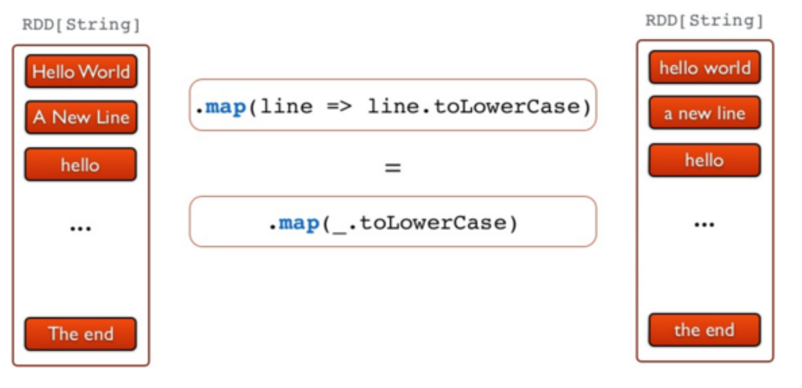
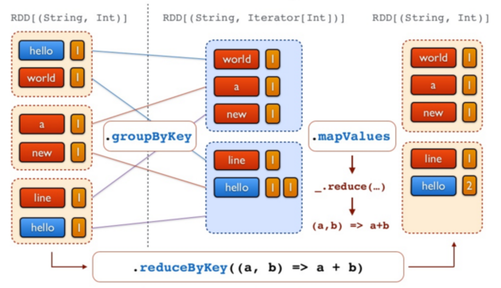

# TP2 - Prise en main de Spark

## Objectifs du TP
Utilisation de Spark pour réaliser des traitements par lot.

## Outils et Versions
* [Apache Hadoop](http://hadoop.apache.org/) Version: 3.3.6
* [Apache Spark](https://spark.apache.org/) Version: 3.5.0
* [Docker](https://www.docker.com/) Version *latest*
* [Visual Studio Code](https://code.visualstudio.com/) Version 1.85.1 (ou tout autre IDE de votre choix)
* [Java](http://www.oracle.com/technetwork/java/javase/downloads/index.html) Version 1.8.
* Unix-like ou Unix-based Systems (Divers Linux et MacOS)

## Spark
### Présentation
[Spark](https://spark.apache.org/) est un framework open-source conçu pour le traitement distribué de calcul sur de grandes volumétries de données. Il fournit des APIs de haut niveau en Java, Scala, Python et R, et un moteur optimisé qui supporte l'exécution des graphes. Il supporte également un ensemble d'outils de haut niveau tels que [Spark SQL](https://spark.apache.org/docs/latest/sql-programming-guide.html) pour le support du traitement de données structurées, [MLlib](https://spark.apache.org/docs/latest/ml-guide.html) pour l'apprentissage des données, [GraphX](https://spark.apache.org/docs/latest/graphx-programming-guide.html) pour le traitement des graphes, et [Spark Streaming](https://spark.apache.org/docs/latest/streaming-programming-guide.html) pour le traitment des données en streaming.


### Spark et Hadoop
Spark peut s'exécuter sur plusieurs plateformes: Hadoop, Mesos, en standalone ou sur le cloud. Il peut également accéder à diverses sources de données, comme HDFS, Cassandra, HBase et S3.

Dans ce TP, nous allons exécuter Spark sur Hadoop YARN. YARN s'occupera ainsi de la gestion des ressources pour le déclenchement et l'exécution des Jobs Spark.

### Installation
Nous avons procédé à l'installation de Spark sur le cluster Hadoop utilisé dans le [TP1](/big-data-course-materials/docs/TP1.md). Suivre les étapes décrites dans la partie _Installation_ du TP1 pour télécharger l'image et exécuter les trois contenaires. 
Si cela est déjà fait, il suffit de lancer vos machines grâce aux commandes suivantes:

```Bash
docker start hadoop-master hadoop-worker1 hadoop-worker2
```

puis d'entrer dans le contenaire master:

```Bash
docker exec -it hadoop-master bash
```

Lancer ensuite les démons yarn et hdfs:
```Bash
./start-hadoop.sh
```

Vous pourrez vérifier que tous les démons sont lancés en tapant: ```jps```. Un résultat semblable au suivant pourra être visible:
```Bash
880 Jps
257 NameNode
613 ResourceManager
456 SecondaryNameNode
```

La même opération sur les noeuds workers (auxquels vous accédez à partir de votre machine hôte de la même façon que le noeud maître, c'est à dire en tapant par exemple ```docker exec -it hadoop-worker1 bash```) devrait donner:
```bash
176 NodeManager
65 DataNode
311 Jps
```
## Test de Spark avec Spark-Shell

Dans le but de tester l'exécution de spark, commencer par créer un fichier _file1.txt_ dans votre noeud master, contenant le texte suivant:
```
Hello Spark Wordcount!
Hello Hadoop Also :)
```

Charger ensuite ce fichier dans HDFS:
```Bash
hdfs dfs -put file1.txt
```

> error "Erreur possible"
      Si le message suivant s'affiche: ```put: `.': No such file or directory```, c'est parce que l'arborescence du répertoire principal n'est pas créée dans HDFS. Pour le faire, il suffit d'exécuter la commande suivante avant la commande de chargement :
      ```hadoop fs mkdir -p . ```


Pour vérifier que spark est bien installé, taper la commande suivante:
```Bash
spark-shell
```

Vous devriez avoir un résultat semblable au suivant:


Vous pourrez tester spark avec un code scala simple comme suit (à exécuter ligne par ligne):

```Scala linenums="1"
val lines = sc.textFile("file1.txt")
val words = lines.flatMap(_.split("\\s+"))
val wc = words.map(w => (w, 1)).reduceByKey(_ + _)
wc.saveAsTextFile("file1.count")
```

Ce code vient de (1) charger le fichier _file1.txt_ de HDFS, (2) séparer les mots selon les caractères d'espacement, (3) appliquer un _map_ sur les mots obtenus qui produit le couple (_<mot\>_, 1), puis un _reduce_ qui permet de faire la somme des 1 des mots identiques.

Pour afficher le résultat, sortir de spark-shell en cliquant sur _Ctrl-C_. Télécharger ensuite le répertoire _file1.count_ créé dans HDFS comme suit:
```Bash
hdfs dfs -get file1.count
```
Le contenu des deux fichiers _part-00000_ et _part-00001_ ressemble à ce qui suit:

<center></center>

## L'API de Spark
Petit rappel: 
A un haut niveau d'abstraction, chaque application Spark consiste en un programme _driver_ qui exécute la fonction _main_ de l'utilisateur et lance plusieurs opérations parallèles sur le cluster. L'abstraction principale fournie par Spark est un RDD (_Resilient Distributed Dataset_), qui représente une collection d'éléments partitionnés à travers les noeuds du cluster, et sur lesquelles on peut opérer en parallèle. Les RDDs sont créés à partir d'un fichier dans HDFS par exemple, puis le transforment. Les utilisateurs peuvent demander à Spark de sauvegarder un RDD en mémoire, lui permettant ainsi d'être réutilisé efficacement à travers plusieurs opérations parallèles.

Les RDDs supportent deux types d'opérations:

  * les _transformations_, qui permettent de créer un nouveau Dataset à partir d'un Dataset existant
  * les _actions_, qui retournent une valeur au programme _driver_ après avoir exécuté un calcul sur le Dataset.

Par exemple, un _map_ est une transformation qui passe chaque élément du dataset via une fonction, et retourne un nouvel RDD représentant les résultats. Un _reduce_ est une action qui agrège tous les éléments du RDD en utilisant une certaine fonction et retourne le résultat final au programme.

Toutes les transformations dans Spark sont _lazy_, car elles ne calculent pas le résultat immédiatement. Elles se souviennent des transformations appliquées à un dataset de base (par ex. un fichier). Les transformations ne sont calculées que quand une action nécessite qu'un résultat soit retourné au programme principal. Cela permet à Spark de s'exécuter plus efficacement.


### Exemple

L'exemple que nous allons présenter ici par étapes permet de relever les mots les plus fréquents dans un fichier. Pour cela, le code suivant est utilisé:

```Scala
//Etape 1 - Créer un RDD à partir d'un fichier texte de Hadoop
val docs = sc.textFile("file1.txt")
```

```Scala
//Etape 2 - Convertir les lignes en minuscule
val lower = docs.map(line => line.toLowerCase)
```
<center></center>

```Scala
//Etape 3 - Séparer les lignes en mots
val words = lower.flatMap(line => line.split("\\s+"))
```
<center></center>

```Scala
//Etape 4 - produire les tuples (mot, 1)
val counts = words.map(word => (word,1))
```
<center></center>

```Scala
//Etape 5 - Compter tous les mots
val freq = counts.reduceByKey(_ + _)
```
<center></center>

```Scala
//Etape 6 - Inverser les tuples (transformation avec swap)
freq.map(_.swap)
```
<center></center>

```Scala
//Etape 6 - Inverser les tuples (action de sélection des 3 premiers)
val top = freq.map(_.swap).top(3)
```
<center></center>

## Spark Batch en Java
### Préparation de l'environnement et Code
Nous allons dans cette partie créer un projet Spark Batch en Java (un simple WordCount), le charger sur le cluster et lancer le job.

  1. Créer un projet Maven avec VSCode, en utilisant la config suivante:
  ```xml
  <groupId>spark.batch</groupId>
  <artifactId>wordcount-spark</artifactId>
  ```
  2. Rajouter dans le fichier pom les dépendances nécessaires, et indiquer la version du compilateur Java:
  ```xml
  <properties>
      <maven.compiler.source>1.8</maven.compiler.source>
      <maven.compiler.target>1.8</maven.compiler.target>
  </properties>
  <dependencies>
      <dependency>
          <groupId>org.apache.spark</groupId>
          <artifactId>spark-core_2.13</artifactId>
          <version>3.5.0</version>
      </dependency>
      <dependency>
          <groupId>org.slf4j</groupId>
          <artifactId>slf4j-reload4j</artifactId>
          <version>2.1.0-alpha1</version>
          <scope>test</scope>
      </dependency>
  </dependencies>
  ```
  3. Sous le répertoire java, créer un package que vous appellerez _spark.batch.tp21_, et dedans, une classe appelée _WordCountTask_.
  4. Écrire le code suivant dans _WordCountTask.java_ :
  ```java
  import org.apache.spark.SparkConf;
  import org.apache.spark.api.java.JavaPairRDD;
  import org.apache.spark.api.java.JavaRDD;
  import org.apache.spark.api.java.JavaSparkContext;
  import org.slf4j.Logger;
  import org.slf4j.LoggerFactory;
  import scala.Tuple2;

  import java.util.Arrays;
  import com.google.common.base.Preconditions;

  public class WordCountTask {
        private static final Logger LOGGER = LoggerFactory.getLogger(WordCountTask.class);

        public static void main(String[] args) {
            Preconditions.checkArgument(args.length > 1, "Please provide the path of input file and output dir as parameters.");
            new WordCountTask().run(args[0], args[1]);
        }

        public void run(String inputFilePath, String outputDir) {
            String master = "local[*]";
            SparkConf conf = new SparkConf()
                    .setAppName(WordCountTask.class.getName())
                    .setMaster(master);
            JavaSparkContext sc = new JavaSparkContext(conf);

            JavaRDD<String> textFile = sc.textFile(inputFilePath);
            JavaPairRDD<String, Integer> counts = textFile
                    .flatMap(s -> Arrays.asList(s.split(" ")).iterator())
                    .mapToPair(word -> new Tuple2<>(word, 1))
                    .reduceByKey((a, b) -> a + b);
            counts.saveAsTextFile(outputDir);
        }
    }
  ```
  La première chose à faire dans un programme Spark est de créer un objet _JavaSparkContext_, qui indique à Spark comment accéder à un cluster. Pour créer ce contexte, vous aurez besoin de construire un objet _SparkConf_ qui contient toutes les informations sur l'application.

    * _appName_ est le nom de l'application
    * _master_ est une URL d'un cluster Spark, Mesos ou YARN, ou bien une chaîne spéciale _local_ pour lancer le job en mode local.

> warning
      Nous avons indiqué ici que notre master est _local_ pour les besoins du test, mais plus tard, en le packageant pour le cluster, nous allons enlever cette indication. Il est en effet déconseillé de la hard-coder dans le programme, il faudrait plutôt l'indiquer comme option de commande à chaque fois que nous lançons le job.

    Le reste du code de l'application est la version en Java de l'exemple en scala que nous avions fait avec spark-shell.

### Test du code en local
Pour tester le code sur votre machine, procéder aux étapes suivantes:

  1. Insérer un fichier texte de votre choix (par exemple le fameux [loremipsum.txt](https://generator.lorem-ipsum.info/)) dans le répertoire src/main/resources.
  2. Lancer le programme en utilisant les arguments suivants:
     1. **Arg1**:  le chemin du fichier _loremipsum.txt_
     2. **Arg2**: le chemin d'un répertoire _out_ sous _resources_ (vous ne devez pas le créer)
  1. Cliquer sur OK, et lancer la configuration. Si tout se passe bien, un répertoire _out_ sera créé sous _resources_, qui contient (entre autres) deux fichiers: part-00000, part-00001.

<center></center>

### Lancement du code sur le cluster
Pour exécuter le code sur le cluster, modifier comme indiqué les lignes en jaune dans ce qui suit:

```java hl_lines="11 12 18"
public class WordCountTask {
  private static final Logger LOGGER = LoggerFactory.getLogger(WordCountTask.class);

  public static void main(String[] args) {
      checkArgument(args.length > 1, "Please provide the path of input file and output dir as parameters.");
      new WordCountTask().run(args[0], args[1]);
  }

  public void run(String inputFilePath, String outputDir) {

      SparkConf conf = new SparkConf()
              .setAppName(WordCountTask.class.getName());

      JavaSparkContext sc = new JavaSparkContext(conf);

      JavaRDD<String> textFile = sc.textFile(inputFilePath);
      JavaPairRDD<String, Integer> counts = textFile
              .flatMap(s -> Arrays.asList(s.split("\t")).iterator())
              .mapToPair(word -> new Tuple2<>(word, 1))
              .reduceByKey((a, b) -> a + b);
      counts.saveAsTextFile(outputDir);
  }
}
```

Lancer ensuite une configuration de type Maven, avec la commande _package_. Un fichier intitulé _wordcount-spark-1.0-SNAPSHOT.jar_ sera créé sous le répertoire target.

Nous allons maintenant copier ce fichier dans docker. Pour cela, naviguer vers le répertoire du projet avec votre terminal (ou plus simplement utiliser le terminal dans VSCode), et taper la commande suivante:

```Bash
docker cp target/wordcount-spark-1.0-SNAPSHOT.jar hadoop-master:/root/wordcount-spark.jar
```

Revenir à votre contenaire master, et lancer un job Spark en utilisant ce fichier jar généré, avec la commande ```spark-submit```, un script utilisé pour lancer des applications spark sur un cluster.

```Bash
spark-submit  --class spark.batch.tp21.WordCountTask --master local wordcount-spark.jar input/purchases.txt out-spark
```

  * Nous allons lancer le job en mode local, pour commencer.
  * Le fichier en entrée est le fichier purchases.txt (que vous déjà chargé dans HDFS dans le TP précédent), et le résultat sera stocké dans un nouveau répertoire _out-spark_.

>warning "Attention"
      Vérifiez bien que le fichier _purchases_ existe dans le répertoire input de HDFS (et que le répertoire _out-spark_ n'existe pas)!
      Si ce n'est pas le cas, vous pouvez le charger avec les commandes suivantes:
      ```
      hdfs dfs -mkdir -p input
      hdfs dfs -put purchases.txt input
      ```

Si tout se passe bien, vous devriez trouver, dans le répertoire _out-spark_, deux fichiers part-00000 et part-00001, qui ressemblent à ce qui suit:

<center></center>

Nous allons maintenant tester le comportement de _spark-submit_ si on l'exécute en mode _cluster_ sur YARN. Pour cela, exécuter le code suivant:
```Bash
  spark-submit  --class spark.batch.tp21.WordCountTask --master yarn --deploy-mode cluster wordcount-spark.jar input/purchases.txt out-spark2
```

  * En lançant le job sur Yarn, deux modes de déploiement sont possibles:
    - **Mode cluster**: où tout le job s'exécute dans le cluster, c'est à dire les Spark Executors (qui exécutent les vraies tâches) et le Spark Driver (qui ordonnance les Executors). Ce dernier sera encapsulé dans un YARN Application Master.
    - **Mode client** : où Spark Driver s'exécute sur la machine cliente (tel que votre propre ordinateur portable). Si votre machine s'éteint, le job s'arrête. Ce mode est approprié pour les jobs interactifs.

Si tout se passe bien, vous devriez obtenir un répertoire out-spark2 dans HDFS avec les fichiers usuels.

>bug "En cas d'erreur: consulter les logs!"
      En cas d'erreur ou d'interruption du job sur Yarn, vous pourrez consulter les fichiers logs pour chercher le message d'erreur (le message affiché sur la console n'est pas assez explicite). Pour cela, sur votre navigateur, aller à l'adresse: ```http://localhost:8041/logs/userlogs```et suivez toujours les derniers liens jusqu'à _stderr_.