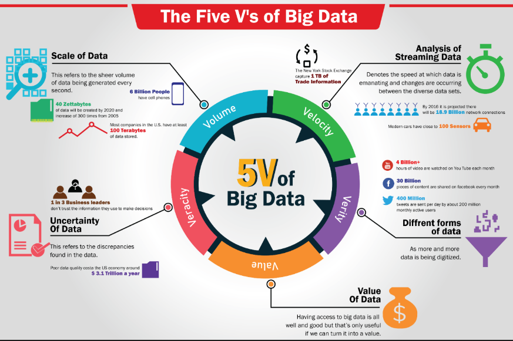
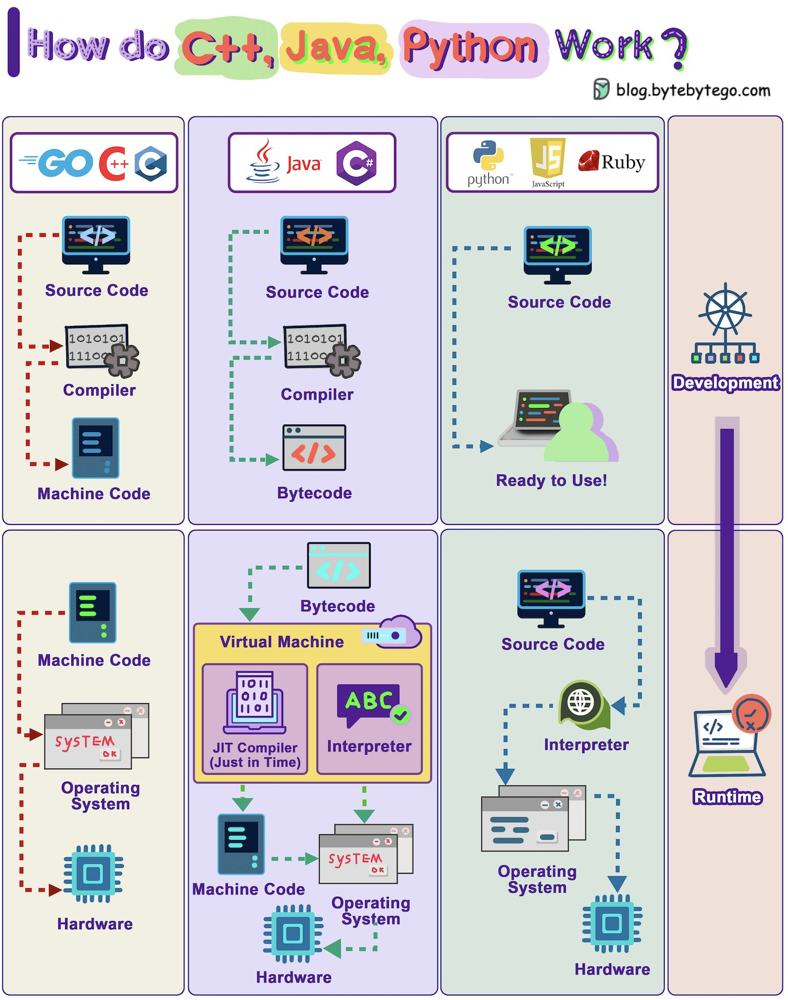
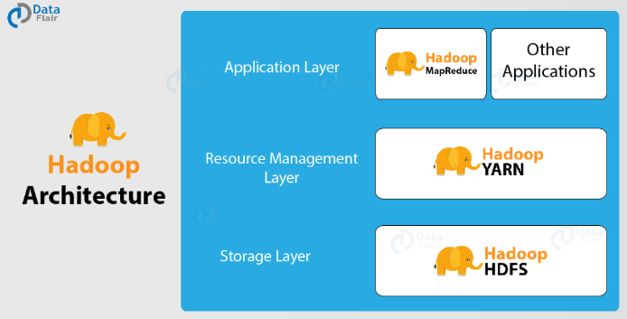
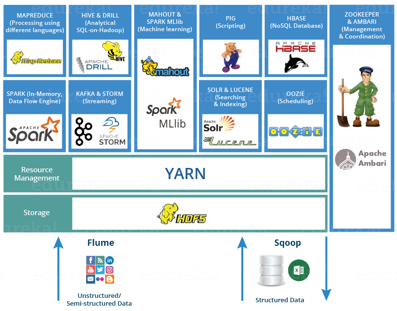
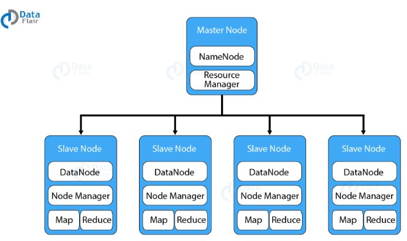
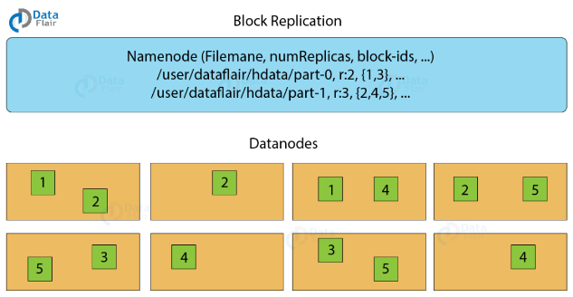

# 1. Intro Big Data 

### 1.1 Définition & Enjeux: 

**A. Définition Big Data**: Big Data, ou "mégadonnées" en français, désigne des ensembles de données extrêmement volumineux, complexes et en croissance rapide, qui dépassent les capacités des outils classiques de gestion de bases de données pour les capturer, stocker, gérer et analyser dans un temps raisonnable.

| Name           | Value (10^) | Value (2^) |
| -------------- | ----------- | ---------- |
| kilobyte (kB)  | 10^3        | 2^10       |
| megabyte (MB)  | 10^6        | 2^20       |
| gigabyte (GB)  | 10^9        | 2^30       |
| terabyte (TB)  | 10^12       | 2^40       |
| petabyte (PB)  | 10^15       | 2^50       |
| exabyte (EB)   | 10^18       | 2^60       |
| zettabyte (ZB) | 10^21       | 2^70       |
| yottabyte (YB) | 10^24       | 2^80       |

Quelques statistiques intéressantes :
- Plus de 1 exaoctet de données est généré chaque jour.
- Une personne moyenne génère 1,7 Mo de données par seconde.
- 90 % des données mondiales ont été créées au cours des deux dernières années.

Les 5 V du Big Data :
- **Volume**: La quantité massive de données générées et stockées.
- **Vélocité**: La vitesse à laquelle les nouvelles données sont générées et circulent, souvent en temps réel ou quasi-réel.
- **Variété**: La diversité des types de données, structurées, semi-structurées et non structurées, provenant de sources multiples.
- **Véracité**: La fiabilité et la qualité des données, qui peuvent être incertaines ou imprécises et nécessitent une validation.
- **Valeur**: La capacité à transformer ces vastes ensembles de données en informations utiles et exploitables pour l'entreprise.




**B. Les Enjeux du Big Data**:
"You can have data without information, but you **can't have information without data**"

La donnée est omniprésente et sa maîtrise est cruciale pour faciliter la prise de décision au sein des entreprises.

Le Big Data présente à la fois des opportunités considérables et des défis complexes. 
D'un côté, il offre la possibilité d'exploiter des volumes massifs d'informations pour gagner en efficacité, innover et créer de la valeur. 

De l'autre, sa gestion comporte de nombreux **défis**: 
- **La lutte contre la "myopie des données"** : Les organisations peinent souvent à localiser et exploiter efficacement leurs propres ressources informationnelles, limitant ainsi leur capacité à tirer pleinement parti de leurs données.
- **La maîtrise du cycle complet de la donnée** : De la collecte à l'analyse et la restitution, en passant par le stockage et la sécurisation, les entreprises doivent gérer efficacement chaque étape du parcours de la donnée.
- **La gestion de la diversité organisationnelle** : La complexité s'accroît avec la multiplicité des entités réparties à travers le monde et les différents fuseaux horaires, rendant la coordination et l'uniformisation des pratiques de gestion des données plus difficiles.
- **Les choix technologiques stratégiques** : Les décisions en matière de technologies doivent prendre en compte la disponibilité des ressources techniques tout en s'adaptant à l'inertie et à la flexibilité des systèmes d'information existants.
- **La garantie de la sécurité et de la conformité** : Les entreprises doivent assurer la sécurité et la confidentialité des données tout en respectant les réglementations en vigueur, ajoutant une couche supplémentaire de complexité à leur stratégie de gestion des données.
- **L'adaptation à un environnement en constante évolution** : Les entreprises doivent rester à jour face aux changements rapides du cadre législatif (par exemple, l'introduction du RGPD en Europe) et aux avancées technologiques continues dans le domaine du traitement des données.

Le Big Data a révolutionné le paysage économique, touchant pratiquement tous les secteurs d'activité. Son influence s'étend bien au-delà de la technologie, transformant profondément des industries diverses (Pharmaceutique, Automobile, Retail, Energie, Agriculture, Luxe, Banque etc....)


**C. Cycle de vie de la donnée:**
La donnée étant la composante de base du Big Data, il est essentiel de comprendre son cycle de vie. Les ingénieurs en Big Data seront amené à intervenir à chaque étape de ce cycle.

-1. Génération/Carthographie des sources > 2. Collecte et acquisition > 3. Stockage > 4. Traitement > 5. management (conformité, qualité, uniformisation, confidentialité etc...) > 6. Analyse > 7. Interprétation et visualisation > 8. Archivage/Suppression


**D. Familles d'outil :**
A chaque étape du parcours de la donnée fait intervenir un/des outillage(s) spécifique(s).
On peut classer les outils de Big Data dans les familles suivantes: 
- Outils d'ingestion/collecte de données: Connecteurs de base de données (ex: jdbc, odbc ...), Airbyte, Kafka, Spark, Flume, Logstash ...
- Outils de stockage: HDFS, HBase, Cassandra, Amazon s3, OracleDB, MongoDB, Google Cloud Storage, Snowflake etc...
- Outils de traitement et d'analyse (dit processing): Hadoop, Spark, Flink, AWS Glue, Databricks, dbt, Hive etc...
- Outils de visualisation: Tableau, PowerBI, Qlik, Kibana, Grafana etc...
- Outils de traitement ML/AI: SparkML, H2O.ai, DataRobot, MLflow, Kubeflow etc...
- Outils de management: Airflow, Databricks Lifecycle management, Luigi etc...


### 1.2) Quelques concepts clés: 

**A. Concepts généraux:**
- **Représentation binaire:** tous les fichiers, quelle que soit leur nature (image, vidéo, texte, son etc...), sont en format binaire au niveau le plus bas du stockage. Donc lorsque HDFS ou tout autre programme manipule les fichiers d'entrée, ils manipulent la représentation binaire de ceux-ci.
  
- **Source code, bytecode, machine code**:
	- Le code source est le code écrit par les développeurs dans un langage de programmation comme Java. 
	- Ce code est ensuite compilé en bytecode, un format intermédiaire indépendant de la plateforme. 
	- Enfin, le machine/binary code est le code binaire spécifique à chaque architecture matérielle (généré par la JVM à partir du bytecode pour l'exécution finale).

- **La JVM (Java Virtual Machine)**: est un moteur d'exécution multiplateforme qui peut exécuter les instructions compilées en bytecode Java. 




- **Fiabilité, Scalabilité, Maintenabilité** :
	- La fiabilité est la capacité d'un système à fonctionner correctement même en cas de problèmes ou de pannes. 
	- La scalabilité est l'aptitude d'un système à s'adapter à une charge croissante. 
	- La maintenabilité concerne la facilité avec laquelle un système peut être modifié, amélioré ou corrigé au fil du temps.

- **Réplication**: 
	La **réplication** consiste à copier et maintenir des données sur plusieurs nœuds pour assurer la disponibilité et la tolérance aux pannes dans un système distribué.
	Le facteur de réplication R standard en Big Data est de: 3 (Le primaire + 2 réplicas)
	
	

	- Stratégies : 
		- Réplication **synchrone vs asynchrone** (Maj des réplicas synchrone ou asynchrone par rapport au primaire.)
		- Réplication **active vs passive** (Actif si les réplicas sont exposés aux utilisateurs de la même manière que le primaire. Passif s'ils servent purement de back-up) 
		  
	- Intérêt en Big Data :
	    - Haute disponibilité : les données restent accessibles même en cas de panne d'un nœud
	    - Tolérance aux pannes : prévient la perte de données en cas de défaillance matérielle
	    - Équilibrage de charge : permet de distribuer les requêtes sur plusieurs réplicas
	    - Amélioration des performances de lecture en multipliant les sources de données

- **Partitionnement** (pour le stockage de données):
	Le partitionnement est une technique de division des données en sous-ensembles plus petits et plus gérables, appelés partitions. Cela permet une meilleure distribution de la charge et une gestion plus efficace des grandes quantités de données dans un environnement Big Data. Un partitionnement dit **logique** s’effectue en fonction d’une **_clé_** de partitionnement, soit un ou plusieurs attributs dont la valeur sert de critère à l’affectation d’un document à un fragment. La première décision à prendre est donc le choix de la clé. Un bon partitionnement répartit les documents en fragments de taille comparable.
	Exemple de clés: par localisation géographique, par année, par région/entités etc....

- **Encodage et Format:**
	-L'encodage concerne la représentation des données au niveau le plus bas, c'est-à-dire la façon dont les caractères (texte) ou les valeurs sont convertis en bits.
	- Exemples d'encodages :
	    - UTF-8, UTF-16, ASCII (Latin caracters) pour le texte
	    - IEEE 754 pour les nombres à virgule flottante
	    - Base64 pour représenter des données binaires (comprend aussi images et sons) en texte (https://stackoverflow.com/questions/3538021/why-do-we-use-base64)
	- Rôle :
	    - Définit comment chaque élément de donnée individuel est représenté en binaire
	    - Assure que les données peuvent être correctement interprétées par différents systèmes et programmes. (Ex: '\\' en fonction des systèmes ce caractère n'aura pas la même signification au moment de la lecture d'un script/fichier)
	    
	-Le format, quant à lui, une manière spécifique d'organiser les informations numériques à un niveau plus élevé. Il détermine comment celles-ci vont êtres lues et traitées par un ordinateur, appareil ou programme.
	- Exemples de formats :
	    - JSON, XML, CSV pour les données structurées
	    - Avro, Parquet, ORC pour les données Big Data
	    - JPEG, PNG pour les images
	- Rôle :
	    - Organise les données de manière logique et cohérente
	    - Facilite l'échange et l'interprétation des données entre différentes applications
	On distinguera 2 types de formats: 
	- Format binaire:
	    - Données stockées directement en séquences de bits
	    - Non lisible directement par l'humain
	    - Optimisé pour le traitement par machine
	    - Exemples: .jpg, .exe, .mp3
	- Format non binaire (ou texte):
	    - Données stockées en caractères lisibles par l'humain
	    - Généralement en encodage ASCII ou Unicode
	    - Peut être ouvert et lu dans un éditeur de texte simple
	    - Exemples: .txt, .csv, .html
	-Relation entre encodage et format :
	- L'encodage est utilisé au sein d'un format : Par exemple, un fichier JSON (format) peut contenir du texte encodé en UTF-8 (encodage).
	- Le format peut spécifier l'encodage : Certains formats, comme XML, permettent de déclarer l'encodage utilisé e.g.,
	```xml
	<?xml version="1.0" encoding="UTF-8"?>
	```
	- Complémentarité : L'encodage assure que les données peuvent être correctement lues au niveau binaire.


**B. Concepts liés au transfert des données à travers le réseau:**
- **Archivage**: Regroupement de fichiers en un seul pour faciliter stockage/transfert. Les fichiers .jar (similaire à des fichiers zip mais spécifique à java) sont utilisés dans Hadoop afin d'encapsuler le code des applications Hadoop, et faciliter le déploiement et l'exécution des jobs sur le cluster. Ces archives contiennent le code et les dépendances (classes java compilées(bytecode), fichiers de configuration, bibliothèques/librairies, fichier manifest etc..) nécessaires à l'exécution du job. 
  
- **Routage et data locality**: 
  -Le routage concerne la manière dont les données sont dirigées (routées) à travers un réseau (cluster de machines). Hadoop s'appuie sur le protocol TCP/IP afin de transporter les données et jobs d'une machine à l'autre.

  

  -Data locality: est une *stratégie* qui vise à rapprocher le traitement des données (jobs/tasks) de leur lieu de stockage pour réduire la latence et améliorer les performances. 
  Retenez bien, il est plus facile de déplacer les jobs/tâches plutôt que les partitions!

- **Sérialisation (et désérialisation):** Processus de conversion d'objets complexes (classe, un dataframe etc...) en séquences d'octets **pour le stockage ou la transmission**, permettant leur reconstruction ultérieure (désérialisation).
    - Techniques : Java Serialization, Protocol Buffers, Thrift, Avro
    - Intérêt en Big Data :
        - Permet le transfert efficace d'objets complexes (instances de classes, enregistrements, paires clé-valeurs, résultats intermédiaires ...) entre nœuds d'un cluster
        - Facilite le stockage d'objets dans des systèmes distribués (ex: HDFS)
        - Optimise la performance en réduisant la taille des données transmises
        - Assure la compatibilité entre différentes versions de données ou de code
	NB: Hadoop utilise son propre framework de sérialisation: Writable (via méthode write(): convertit l'objet en bytes et readFields(): reconstruit l'objet à partir des bytes)


**C. Concepts liés au computing:**
- **Le programme, le processus & le daemon:**
	- Un programme: un ensemble d'instructions écrites par un développeur. Il est stocké sous forme de fichier exécutable sur un support de stockage. Le programme reste passif jusqu'à son lancement.
	- Un processus: une instance active d'un programme en cours d'exécution. Il occupe de la mémoire et utilise des ressources du système. Chaque processus a son propre état qui évolue au fil du temps. Le système d'exploitation gère les processus. Un même programme peut générer plusieurs processus distincts. Chaque processus possède ses propres ressources allouées. Chaque processus peut contenir plusieurs threads. Ces threads sont des unités d'exécution plus légères au sein d'un processus. Ils partagent le même espace mémoire du processus parent.
	- Un daemon: est un programme informatique qui s'exécute en arrière-plan, plutôt que sous le contrôle direct d'un utilisateur interactif.

	


- **Single machine, cloud & distributed computing:**
	- Single machine computing (multi-tasks vs multicore parallelism) : 
		- Multi-tasking: la capacité de notre machine à traiter plusieurs tâches liées à des programmes différents. Le multitâche donne l'illusion de parallélisme par commutation rapide (en sautant d'une tâche à l'autre).
		- Le parallélisme multicœur: exécution en parallèle et simultanée sur différents cœurs de tâches liées à des programmes différents. 
	- Cloud computing: pratique consistant à utiliser un/des serveur(s) informatique(s) à distance, hébergé(s) dans des centres de données connectés à Internet pour stocker, gérer et traiter des données, plutôt qu'un serveur local ou un ordinateur personnel.
	- Distributed computing : méthode qui consiste à faire travailler ensemble plusieurs ordinateurs en réseau afin de résoudre un problème commun. Le problème étant divisé en plusieurs tâches, chacune d'elles est résolue par un ou plusieurs ordinateurs qui communiquent entre eux.

- **Vertical scaling vs Horizontal scaling:** 
  Le scaling vertical consiste à augmenter les ressources d'une seule machine, tandis que le scaling horizontal implique l'ajout de machines supplémentaires à un système distribué.


# 2. Hadoop 

**Hadoop** est un :
- **framework**: 'cadre de travail' composé d'un ensemble de bibliothèques, d'outils, de conventions de codage, et de modèles de conception qui simplifient et accélèrent le processus de développement logiciel
- **open-source**: conçu pour être accessible au public, n'importe qui peut voir, modifier et distribuer le code comme il l'entend.
- conçu pour le stockage et le traitement distribué de grandes quantités de données (Big Data) sur des clusters de machines ordinaires. 
Il a été développé par la Apache Software Foundation et est devenu l'un des outils les plus populaires pour gérer le Big Data.

Hadoop sert principalement à :
1. Stocker de grandes quantités de données de manière distribuée et fiable.
2. Traiter ces données en parallèle sur plusieurs machines.
3. Gérer les pannes matérielles de manière transparente.
4. Permettre une scalabilité horizontale facile (ajout de nouvelles machines au cluster).


Hadoop a une topologie dite "maître-esclave"(master-slave en anglais). 
Dans cette topologie, nous avons _un nœud maître et plusieurs nœuds esclaves_. 
-La fonction du nœud maître (master node) est d'assigner une tâche aux différents nœuds esclaves et de gérer les ressources. Il stocke les métadonnées, à savoir les informations relatives aux données stockés (comme l'emplacement des blocs/partitions à travers le réseau de noeuds esclaves).
-Les nœuds esclaves (slave nodes) effectuent le calcul proprement dit. Ils sont aussi ceux qui stockent les données réelles.


### 2.1) Écosystème Hadoop
L'écosystème Hadoop comprend un ensemble de projets et d'outils complémentaires qui s'intègrent avec les composants principaux de Hadoop pour fournir des fonctionnalités supplémentaires.



Les composants prinicipaux de cet écosystème: 
– **HDFS** est utilisé pour distribuer de grands ensembles de données
– YARN (Yet Another Resource Negotiator) : une sorte de système d'exploitation pour Hadoop. Introduit dans Hadoop 2.0, il gère les ressources du cluster, permet l'exécution d'applications distribuées autres que MapReduce sur le cluster Hadoop (ex: Spark, Hive, Pig etc...). 
– **MapReduce** application utilisée pour distribuer une tâche de calcul à un ensemble de données distribuées.



Autres composants importants:
- Hive : Permet d'exécuter des requêtes SQL-like sur les données stockées dans HDFS.
- Pig : Langage de haut niveau pour l'analyse de données.
- HBase : Base de données NoSQL distribuée pour le stockage de grandes tables.
- Spark : Framework et moteur de traitement de données en mémoire (souvent utilisé avec Hadoop).
- Oozie : Planificateur de workflows pour les jobs Hadoop.
- Sqoop : Outil pour transférer des données entre bases de données relationnelles et Hadoop.
- Flume : Service pour collecter, agréger et déplacer de grandes quantités de données de log.


### 2.2) HDFS, MapReduce et YARN

#### 2.2.1) HDFS
HDFS signifie Système de Fichiers Distribués Hadoop (Hadoop Distributed File System, un 'File System' est une méthode et une structure de données (arborescente) que le système d'exploitation utilise pour contrôler la manière dont les données sont stockées et récupérées sur un dispositif de stockage, tel qu'un disque dur, un disque SSD ou même un stockage en nuage.). 
Il assure le **stockage des données sur Hadoop**. Toutes donnée stockée est subdivisée par HDFS  en unités plus petites appelées blocs puis opère à son stockage **sur disque** de manière distribuée (ie réparti sur plusieurs machines/noeuds). 

Pour fonctionner, HDFS s'appuie sur 2 daemons: 
-L'un qui tourne sur le nœud principal (master node), appelé: **NameNode**. Il est responsable de la gestion de l'espace de noms et régule l'accès aux fichiers par le client (programme/application qui fait les requêtes pour accéder aux fichiers). Il s'agit par exemple d'actions telles que l'ouverture, la fermeture et le renommage de fichiers ou de répertoires. Il assure également le suivi de la correspondance entre les blocs de données (la data) et les nœuds de données qui les stocke (les machines).

-Et l'autre qui tourne sur les nœuds esclaves (slave nodes), appelé: **DataNode**. Ils sont responsables du stockage réel des données. Ils répondent aux demandes de lecture/écriture des clients du système de fichiers. Le DataNode crée, supprime et réplique également des blocs à la demande du NameNode.



Aspects clés du fonctionnement de HDFS:
- **Block Protocol**:
    - HDFS traite tous les fichiers comme des données binaires. Il ne fait pas de distinction entre les types de fichiers lorsqu'il les divise en blocs. L'application qui lit les données de HDFS est chargée de les interpréter correctement.
    - HDFS divise les fichiers en blocs (typiquement 128 Mo ou 256 Mo). Chaque bloc est répliqué sur plusieurs nœuds esclaves (le facteur de réplication par défaut est de 3 = 1 primaire + 2 répliques).
    
      

- **Heartbeat Protocol**:
    - DataNodes envoie périodiquement des "heartbeats" (signes de vie) au NameNode.
    - Cela aide le NameNode à garder en vue les DataNodes actifs et disponibles. 
      
- **(HDFS) Data Transfer Protocol**: variante du protocole TCP/IP et qui s'appuie sur celui-ci pour le transfert de données (binary code) / tâches (bytecode) à travers les noeuds du cluster Hadoop. 
  
- **Replication Protocol**:
	- Lors de l'écriture de données, HDFS utilise un pipeline pour répliquer les blocs entre les DataNodes. Ce processus de réplication suit un protocole spécifique pour garantir l'intégrité et la redondance des données.
	  
      

- **Balancer Protocol**:
    - HDFS comprend un équilibreur qui redistribue les données entre les DataNodes afin de maintenir une distribution uniforme. Ce qui implique que plusieurs blocks ou partitions peuvent se retrouver sur le même noeud esclave (slave node). 


#### 2.2.2) MapReduce
MapReduce est la couche (par défaut) de traitement des données de Hadoop.
C'est aussi un modèle de programmation conçu pour traiter et transformer de grands volumes de données en parallèle. L'idée étant que l'utilisateur développe une application Hadoop en s'appuyant sur le modèle MapReduce qui permet ainsi la parallélisation des jobs de l'application sur un ensemble de machines. 

Une tâche MapReduce repose sur deux opérations fondamentales : 
- **Map**: la fonction Map reçoit l’input à partir du disque (déjà) sous forme de paires "clé/valeur". Ces paires sont triés et traitées, et un autre ensemble de clé/valeur intermédiaire est produit.
- et **Reduce**: Après que tous les mappers aient terminé leurs tâches de traitement, le framework mélange et organise les résultats (on appelle cela le shuffling). Les paires sont ensuite transmises aux "reducers". (Attention, un reducer ne peut démarrer si un mapper est encore actif.) La fonction Reduce reçoit donc aussi les inputs sous forme de paires clé/valeur. Toutes les valeurs produites par map **ayant la même clé sont assignées à un reducer unique**. Celui-ci se charge d’**agréger (somme, total, moyenne, ...) les valeurs pour cette clé**. Reduce produit ensuite un ouput final, toujours sous forme de paie clé/valeur.


Chaque tâche travaillant sur une partie des données. Cela permet de répartir la charge de calcul sur l'ensemble des machines du cluster. L'idée est de décomposer le job principal en tâches (maps et reduces) qui peuvent être exécutées en parallèle sur un sous-ensemble des données initiales. Donc ne s'applique que pour des jobs qui peuvent être parallélisés. 
Souvent, ce ne sont pas les opérations MAP et REDUCE qui sont les plus difficiles à concevoir mais la manière de représenter les données pour permettre d'appliquer facilement le modèle.

NB: A noter que les résultats intermédiaires tout comme finaux sont stockés sur disque ! (et pas en RAM comme avec Spark)

Un exemple classique est le programme WordCount (que nous verrons lors du TP1). La fonction Map émet un 1 pour chaque mot rencontré. La fonction Reduce somme ces 1 pour chaque mot unique, donnant ainsi le compte total de chaque mot dans le texte.

#### 2.2.3) YARN
YARN (Yet Another Resource Negotiator) est le gestionnaire de ressources et planificateur de tâches du framework Hadoop. Il a été conçu pour séparer la gestion des ressources du traitement des données, offrant ainsi une plus grande flexibilité et efficacité dans l'utilisation des ressources du cluster. Yarn se charge de l'allocation de conteneurs ie de ressource pour le traitement et calcul (CPU et mémoire). 

Yarn divise les tâches de gestion des ressources et de planification/surveillance des travaux en 2 daemons distincts: 
- **ResourceManager**: il tourne sur le master node YARN et son rôle est d'arbitrer les ressources entre toutes les applications concurrentes du système (applications MapReduce ou Spark, Hive, Pig etc....). Il gère et alloue les ressources du cluster de manière globale. C'est lui qui indique sur quel nœud esclave faire tourner une application en fonction des disponibilités du cluster. Il décide aussi quelles applications ont priorité en cas de conflit de ressources.
- **NodeManager**: Il tourne sur les slave nodes YARN et son rôle est de surveiller et de rendre compte de l'utilisation des ressources par les divers conteneurs mis à disposition pour faire tourner les applications soumises s'exécutant sur le nœud. 
  On a donc un NodeManager par slave node. Chaque conteneur (qui ne sont que des fractions des ressources telles que l'unité centrale, la mémoire, le disque, le réseau, etc.) est isolé, permettant à des applications différentes de s'exécuter sans interférence.
  NodeManager -> ResourceManager: transmet des informations agrégées sur l'utilisation des ressources du nœud.
  NodeManager -> ApplicationMaster: transmet des informations détaillées sur les conteneurs spécifiques à l'application.

Chaque application/Job (MapReduce, Spark, Hive etc...) se voit attribué un **ApplicationMaster** pendant la durée d'exécution du job. Une application étant un job ou un DAG (graphe composée de plusieurs jobs séquencés) de jobs. 
**L'applicationMaster est un processus crée par le ResourceManager de YARN afin de gérer la négociation des ressources** (avec le ResourceManager), mais aussi surveiller l'exécution et redémarrer un conteneur en cas d'incident de l'application concernée (en collaboration avec le NodeManager). Si un ApplicationMaster échoue, le ResourceManager peut le relancer.

Vous remarquerez que le ResourceManager est le chef d'orchestre de tout cela, s'il crash, aucune application ne peut plus s'exécuter sur le cluster. YARN dispose d'un mode dit "HA" (High Availability). C'est une configuration qui vise à éliminer le point unique de défaillance (Single Point Of Failure) dans un cluster Hadoop en permettant l'exécution de multiples instances du ResourceManager. Pour cela, il s'appuie sur Apache Zookeeper. 


### 2.3) Zookeeper 

Apache ZooKeeper est un service centralisé permettant de maintenir les informations de configuration, de nommage, de synchronisation distribuée et de services de groupe dans les systèmes distribués.
Autrement dit, il assure la coordination distribuée nécessaire au mode HA de YARN, garantissant que le cluster reste opérationnel même si les instances individuelles de ResourceManager tombent en panne. Il agit comme un service fiable et centralisé pour maintenir l'état partagé critique et gérer l'élection du leader parmi les composants YARN.


1. Mode haute disponibilité (HA) :
   - Le mode HA garantit qu'un service reste opérationnel même si l'une de ses instances tombe en panne.
   - Dans le contexte du YARN, il s'agit typiquement d'avoir plusieurs instances de ResourceManager pour éviter un point de défaillance unique.

2. Comment ZooKeeper gère le HA :
   - ZooKeeper maintient l'état du cluster et coordonne l'élection du leader.
   - Pour YARN HA :
     a. Plusieurs instances de ResourceManager sont configurées.
     b. ZooKeeper détermine quelle instance est active et laquelle est en attente.
     c. Si l'instance active tombe en panne, ZooKeeper facilite l'élection d'une nouvelle instance active parmi les instances en attente.
   - ZooKeeper utilise son protocole de consensus pour s'assurer que tous les nœuds ont une vision cohérente du ResourceManager actif.

3. Interaction de ZooKeeper avec YARN :
   - ZooKeeper ne gère pas directement les processus YARN. Il fournit plutôt des services que YARN utilise pour l'AH :
     a. Stockage de l'état du cluster
     b. Élection du leader pour le ResourceManager
     c. Clôture pour éviter les scénarios de cerveau divisé


---
Sources:
- https://data-flair.training/blogs/hadoop-architecture/
- https://github.com/backstreetbrogrammer/11_JavaSpark
- https://www.scilife.io/blog/stages-data-lifecycle-management
- https://blog.bytebytego.com/
- https://www.qlik.com/us/data-replication/database-replication
- https://datascientest.com/mapreduce
- https://www.youtube.com/watch?v=WBrAPR5JyBw&ab_channel=RishiSrivastava